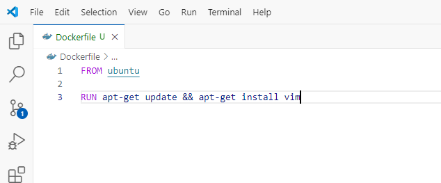
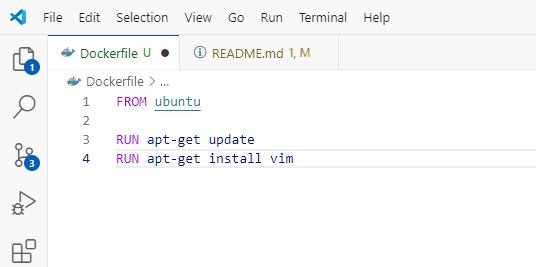
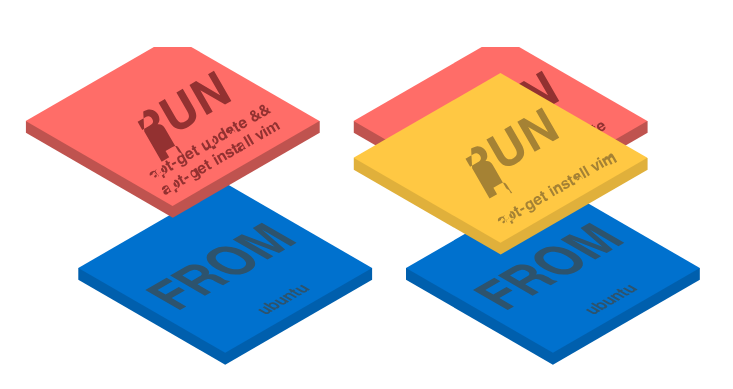

# **Docker Optimization**

## Methods to optimize and achieve smaller Docker images

### When it comes to building Docker containers, you should always strive for smaller images. Images that share layers and are smaller in size are quicker to transfer and deploy

### But how do you keep the size under control when every **RUN** statement creates a new layer, and you need intermediate artifacts before the image is ready?

### You may have noticed that most of the **Dockerfiles** in the wild have some weird tricks like this

### Why the **&&**? Why not running two **RUN** statements like this?

Since Docker 1.10 the **COPY**, **ADD** and **RUN** statements add a new layer to your image. The previous example created two layers instead of just one.

### **Layers are like git commits.**

### Docker layers store the difference between the previous and the current version of the image and like git commits they're handy if you share them with other repositories or images. In fact, when you request an image from a registry you download only the layers that you don't own already. This way is much more efficient to share images, but layers are not free.

### Layers use space and the more layer you have, the heavier the final image is. Git repositories are similar in this respect. The size of your repository increases with the number of layers because Git has to store all the changes between commits. In the past, it was a good practice to combine several RUN statements on a single line as shown in the first example; Not anymore we are going to use the same technique.

### **1. Squash multiple layers into one with multi-stage Docker builds**

